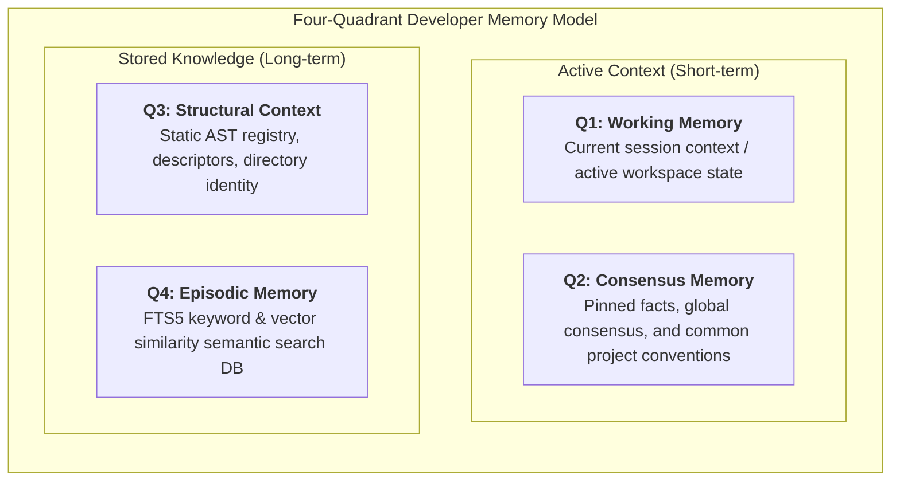
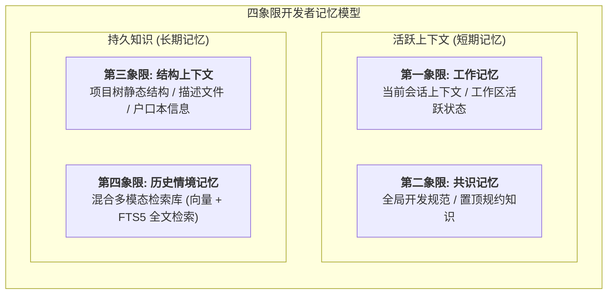

# QMem: High-Performance Mojo MCP Memory Server

[English](#english) | [中文](#中文)

---

## English

### 💡 Core Concept: The Four-Quadrant Memory Architecture
`QMem` is a high-performance Model Context Protocol (MCP) memory server written in **pure Mojo**. Its core architectural concept is **The Four-Quadrant Developer Memory Model**, which categorizes and stores developer experiences, context, and code logic to allow LLMs to read and recall them with sub-millisecond latency.

Unlike simple linear stores, it structures memory into a 2x2 layout separating **Active Context** (short-term) from **Stored Knowledge** (long-term).



---

### 🔄 Working Modes: Push, Pull & Query
`QMem` operates in three distinct modes to coordinate memory exchange between the LLM and the repository:

1. **Push (推送 / Save & Update)**:
   - The LLM proactively saves important decisions, bug fixes, or architecture designs into Q4 Episodic Memory.
   - When a specific keyword/topic is hit, it triggers an auto-upsert in SQLite.
2. **Pull (拉取 / Semantic Recall)**:
   - Queries are processed using Reciprocal Rank Fusion (RRF) hybrid search.
   - The system performs FTS5 keyword matching and ONNX vector cosine similarity matching, prioritizing Q2 Consensus Memory (pinned entries).
3. **Query (查询 & 探测 / Search & Context)**:
   - Performs structural directory analysis (identity probing like Pom/Package descriptors) to build Q3 Structural Context.
   - Allows strict filtering by scope (`project`, `personal`) and memory types.

---

### 🛠️ Technology Stack
- **Compiler**: Mojo 0.26.2 (Native C-compatible compilation).
- **Inference Engine**: ONNX Runtime (BGE-Small-ZH-v1.5 model) bridged via native FFI.
- **Database Engine**: SQLite3 with FTS5 and `sqlite-vec` extension (enabling direct embedding storage and Match queries).

---

### 📜 Attribution & Design Philosophy
`QMem` inherits its core protocol designs and semantic memory philosophy from the open-source [codebase-memory](https://github.com/craws/codebase-memory) project. 

Our design philosophy centers around:
- **Zero-Dependency High Performance**: Replacing Python's interpreter overhead and PyInstaller packaging bloat with native machine code.
- **Cognitive Coexistence**: Mapping human-like memory quadrants (Short-term working memory vs Long-term episodic memory) to SQLite & Vector indices for semantic reasoning.

---

### 📁 Project Structure
```text
QMem/
├── src/                    # Mojo Source files
│   ├── mcp_server.mojo     # Main entry point (JSON-RPC stdio loop)
│   ├── tokenizer.mojo      # Native WordPiece tokenizer
│   ├── sqlite_ffi.mojo     # SQLite3 FFI bindings
│   ├── ort_ffi.mojo        # ONNX Runtime FFI bindings
│   └── json_utils.mojo     # Native JSON parsing helpers
├── shims/                  # C/C++ FFI shim source files
│   ├── mj_sqlite.c         # SQLite double-pointer flattener shim
│   └── ort_helper.cpp      # ONNX Runtime C FFI shim
├── tests/                  # Mojo & Python test files
│   ├── test_ort_ffi.mojo   # Test for ONNX inference
│   ├── test_sqlite_ffi.mojo# Test for SQLite CRUD
│   ├── test_mcp.py        # Integration test (JSON-RPC)
│   └── ...
├── release/                # Standalone portable release folder
│   ├── qmem_mcp         # Compiled binary
│   └── ...
└── LICENSE                 # MIT License
```

---

### 🛠️ Build & Usage

#### Compilation:
1. Compile the shims:
   ```bash
   gcc -shared -fPIC -o libmj_sqlite.so shims/mj_sqlite.c -lsqlite3
   g++ -shared -fPIC -o libort_helper.so shims/ort_helper.cpp -I./ort_sdk/include -L./ort_sdk/lib -lonnxruntime
   ```
2. Build the server binary:
   ```bash
   mojo build src/mcp_server.mojo -o qmem_mcp
   ```

#### Execution:
Configure your MCP Client (e.g., Claude Desktop) to point to the `release/start_mcp.sh` script, which configures the shared libraries automatically.

---
---

## 中文

### 💡 核心思想：四象限记忆模型
`QMem` 是一个使用 **纯 Mojo** 语言编写的高性能模型上下文协议 (MCP) 记忆服务器。其核心架构思想为 **四象限开发者记忆模型**。

与传统的单维度线性存储不同，本项目将开发者的上下文在逻辑上划分为 **活跃上下文（短期）** 与 **持久知识（长期）** 的 2x2 四象限结构，以便大语言模型以低于 1 毫秒的延迟进行检索。



---

### 🔄 工作模式：推送、拉取与查询 (Push, Pull & Query)
`QMem` 通过三种核心模式无缝调谐大模型与本地库的数据交换：

1. **推送 (Push / 存储与更新)**:
   - LLM 发现重要决策、Bug 修复或重构知识时，通过 `mem_save` 或 `mem_update` 主动写入第四象限。
   - 对指定的主题（Topic Key）进行自动覆盖更新 (Upsert)。
2. **拉取 (Pull / 语义召回)**:
   - 检索时执行 RRF 混合检索算法，同时检索 FTS5 全文索引与 ONNX 向量相似度，并在此基础上对第二象限（全局共识/置顶记忆）进行加权提升。
3. **查询 (Query / 探测与列表)**:
   - 静态分析目录特征（Git Remote / Pom 描述），动态生成第三象限结构上下文，支持按域（`project`、`personal`）和类型精细化过滤查询。

---

### 🛠️ 技术栈
- **编译器**：Mojo 0.26.2 (原生 C 兼容编译，零 Python 依赖)。
- **推理引擎**：ONNX Runtime (BGE-Small-ZH-v1.5) 通过 FFI 动态加载。
- **数据库**：SQLite3，结合 FTS5 与 `sqlite-vec` 扩展提供原生的全文检索与向量余弦相似度计算。

---

### 📜 开源声明与设计哲学
本项目的核心记忆表示设计和协议标准借鉴并致敬了开源项目 [codebase-memory](https://github.com/craws/codebase-memory)。

我们的设计哲学为：
- **认知共生架构**：在底层数据库及向量架构中模拟人类脑部认知模式（短期工作记忆与长期情景记忆），增强模型的开发心智模型。

---

### 📦 初始化与依赖下载 (首次安装)

如果需要在新机器上从头部署（特别是使用 Python 回退版本时），你需要下载嵌入模型和 ONNX Runtime 环境。为了保持仓库整洁，我们不提供独立的脚本，你可以直接运行以下 Python 代码完成初始化：

#### 1. 下载 BGE 向量模型
你需要安装 `huggingface_hub`。这会将模型下载到 `bge-small-zh-v1.5-onnx` 目录中。
```python
import os
from huggingface_hub import snapshot_download

# 使用 HF 镜像站加速下载 (国内网络)
os.environ['HF_ENDPOINT'] = 'https://hf-mirror.com'

print("Downloading ONNX model from hf-mirror...")
snapshot_download(
    repo_id="Xenova/bge-small-zh-v1.5", 
    local_dir="bge-small-zh-v1.5-onnx", 
    local_dir_use_symlinks=False
)
print("✅ Download complete.")
```

#### 2. 下载 ONNX Runtime SDK (C/C++ FFI 需要)
如果你需要自己编译 Linux 版或准备跨平台环境，可以运行以下代码下载并解压：
```python
import urllib.request
import tarfile
import os
import shutil

os.makedirs("ort_sdk", exist_ok=True)
linux_url = "https://github.com/microsoft/onnxruntime/releases/download/v1.18.1/onnxruntime-linux-x64-1.18.1.tgz"
linux_tgz = "onnxruntime-linux-x64-1.18.1.tgz"

print("Downloading ONNX Runtime Linux x64 SDK...")
if not os.path.exists(linux_tgz):
    urllib.request.urlretrieve(linux_url, linux_tgz)

print("Extracting...")
with tarfile.open(linux_tgz, "r:gz") as tar:
    tar.extractall("ort_sdk")

extracted_dir = os.path.join("ort_sdk", "onnxruntime-linux-x64-1.18.1")
target_dir = os.path.join("ort_sdk", "linux")
if os.path.exists(extracted_dir):
    if os.path.exists(target_dir):
        shutil.rmtree(target_dir)
    os.rename(extracted_dir, target_dir)
print("✅ Linux SDK setup complete in ort_sdk/linux.")
```

---

### 🐍 Python 回退版 (Windows / 跨平台)

除了原生的 Mojo 实现（性能最佳，目前主要用于 Linux），本项目还提供了一套等效的 **Python 回退版**。这在 Mojo 暂未完全支持的平台（如原生 Windows）上非常有用。

Python 版本的代码全部位于 `python/` 目录下。

**启动方式：**
- **Windows**: 双击或在配置中指定 `python/start_python_mcp.bat`
- **Linux/macOS**: 执行 `python/start_python_mcp.sh`

*注：由于 Windows 测试机正在使用该版本进行全面测试，请确保依赖的 `core_memory.db` 和 ONNX 模型在运行目录（如 `C:\QMem`）下存在，否则可能会触发错误。*
