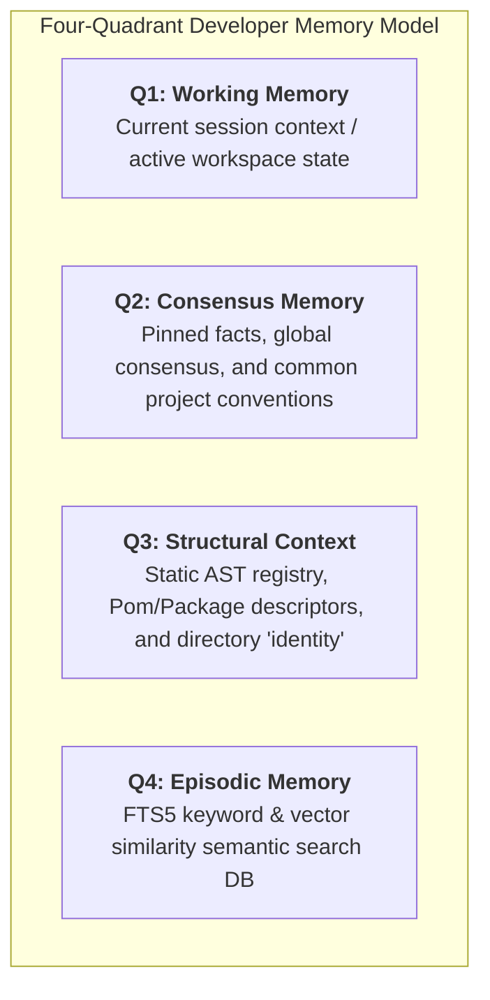

# Mojomem: High-Performance Mojo MCP Memory Server

[English](#english) | [中文](#中文)

---

## English

### 💡 Core Concept: The Four-Quadrant Memory Architecture
`Mojomem` is a high-performance Model Context Protocol (MCP) memory server written in **pure Mojo**. Its core architectural concept is **The Four-Quadrant Developer Memory Model**, which categorizes and stores developer experiences, context, and code logic to allow LLMs to read and recall them with sub-millisecond latency.



1. **Q1: Working Memory (工作记忆 / 活跃上下文)**: Keeps track of the immediate conversation context, active variables, and current workspace modifications.
2. **Q2: Consensus Memory (共识记忆 / 全局规约)**: Stores global consensus facts, common project conventions, and pinned items that are boosted during semantic recalls.
3. **Q3: Structural Context (结构记忆 / 项目户口本)**: Contains static configurations, Pom/Package/Git Remote descriptors, and directory AST structural information.
4. **Q4: Episodic Memory (历史记忆 / 语义数据库)**: A persistent repository storing all experiences, indexed via hybrid search (SQLite FTS5 text match + ONNX cosine vector embeddings).

---

### 🚀 Key Features
- **Zero Python Runtime Dependency**: Rewritten from scratch in Mojo 0.26, removing PyInstaller and Python environment cold-start overhead.
- **Native FFI Bridging**: Utilizes Mojo `OwnedDLHandle` to execute SQLite3 and ONNX Runtime calls natively with zero-overhead C shims.
- **Embedded WordPiece Tokenizer**: Built-in native Mojo tokenizer that parses HuggingFace `tokenizer.json` directly.
- **Portable Packaging**: The compiled executable is bundled into a single standalone directory, ready for deployment to offline or air-gapped target environments.

---

### 📁 Project Structure
The project layout is organized following clean package and compilation conventions:
```text
mojomem/
├── src/                    # Mojo Source files
│   ├── mcp_server.mojo     # Main entry point (JSON-RPC stdio loop)
│   ├── tokenizer.mojo      # Native WordPiece tokenizer
│   ├── sqlite_ffi.mojo     # SQLite3 FFI bindings
│   ├── ort_ffi.mojo        # ONNX Runtime FFI bindings
│   └── json_utils.mojo     # Native JSON parsing helpers
├── shims/                  # C/C++ FFI shim source files
│   ├── mj_sqlite.c         # SQLite double-pointer flattener shim
│   └── ort_helper.cpp      # ONNX Runtime C FFI shim
├── tests/                  # Mojo & Python test files
│   ├── test_ort_ffi.mojo   # Test for ONNX inference
│   ├── test_sqlite_ffi.mojo# Test for SQLite CRUD
│   ├── test_mcp.py        # Integration test (JSON-RPC)
│   └── ...
├── release/                # Standalone portable release folder
│   ├── mojomem_mcp         # Compiled binary
│   └── ...
└── README.md
```

---

### 🛠️ Build & Usage

#### Compilation:
1. Compile the shims:
   ```bash
   gcc -shared -fPIC -o libmj_sqlite.so shims/mj_sqlite.c -lsqlite3
   g++ -shared -fPIC -o libort_helper.so shims/ort_helper.cpp -I./ort_sdk/include -L./ort_sdk/lib -lonnxruntime
   ```
2. Build the server binary:
   ```bash
   mojo build src/mcp_server.mojo -o mojomem_mcp
   ```

#### Execution:
Configure your MCP Client (e.g., Claude Desktop) to point to the `release/start_mcp.sh` script, which configures the shared libraries automatically.

---
---

## 中文

### 💡 核心思想：四象限记忆模型
`Mojomem` 是一个使用 **纯 Mojo** 语言编写的高性能模型上下文协议 (MCP) 记忆服务器。其核心架构思想为 **四象限开发者记忆模型**，将开发者的开发经历、环境上下文和项目代码逻辑进行分类与持久化，从而让大语言模型（LLM）能够以毫秒级的响应速度进行精准召回。

1. **第一象限 (Q1): 工作记忆 (Working Memory)**: 追踪当前的会话活跃上下文、临时变量和活动的工作区修改。
2. **第二象限 (Q2): 共识记忆 (Consensus Memory)**: 存储全局性的共识事实、项目公共规范和置顶知识（在语义检索中享有更高的匹配权重）。
3. **第三象限 (Q3): 结构上下文 (Structural Context)**: 涵盖项目的静态结构树、配置文件（Pom/Package/Git Remote）以及目录“户口本”等身份描述。
4. **第四象限 (Q4): 历史情境记忆 (Episodic Memory)**: 历史经验沉淀的数据库，通过 FTS5 关键词匹配与 ONNX 向量相似度进行混合多模态检索。

---

### 🚀 核心技术特性
- **运行时零 Python 依赖**：使用 Mojo 0.26 纯原生编写，彻底摆脱 PyInstaller 打包臃肿和 Python 冷启动的性能瓶颈。
- **原生 C FFI 桥接**：利用 Mojo 的 `OwnedDLHandle` 通过极简 C/C++ Shim 直接互操 SQLite3 与 ONNX Runtime，无封装性能损耗。
- **内置 WordPiece 分词器**：在 Mojo 中原生实现了分词引擎，能直接读取解析 HuggingFace 的 `tokenizer.json`。
- **独立离线打包**：编译出的二进制与所需 `.so` 库统一整理至 `release/`，开箱即用，特别契合离线或物理隔离环境部署。

---

### 📁 项目结构
项目结构符合 Mojo 官方包管理与测试目录的最佳实践规范：
```text
mojomem/
├── src/                    # Mojo 核心源码
│   ├── mcp_server.mojo     # 主程序入口 (JSON-RPC stdio 循环)
│   ├── tokenizer.mojo      # 原生分词器
│   ├── sqlite_ffi.mojo     # SQLite3 接口绑定
│   ├── ort_ffi.mojo        # ONNX Runtime 接口绑定
│   └── json_utils.mojo     # JSON 解析助手
├── shims/                  # C/C++ FFI 垫片源码
│   ├── mj_sqlite.c         # SQLite3 垫片 (消除双指针限制)
│   └── ort_helper.cpp      # ONNX Runtime 垫片
├── tests/                  # 单元与集成测试目录
│   ├── test_ort_ffi.mojo   # ONNX 推理测试
│   ├── test_sqlite_ffi.mojo# SQLite3 测试
│   ├── test_mcp.py        # MCP 集成测试 (JSON-RPC 模拟)
│   └── ...
├── release/                # 便携式离线发布包
│   ├── mojomem_mcp         # 编译后的主程序
│   └── ...
└── README.md
```

---

### 🛠️ 编译与使用

#### 编译项目：
1. 编译 C/C++ 垫片 (shims)：
   ```bash
   gcc -shared -fPIC -o libmj_sqlite.so shims/mj_sqlite.c -lsqlite3
   g++ -shared -fPIC -o libort_helper.so shims/ort_helper.cpp -I./ort_sdk/include -L./ort_sdk/lib -lonnxruntime
   ```
2. 编译主程序二进制：
   ```bash
   mojo build src/mcp_server.mojo -o mojomem_mcp
   ```

#### 运行服务：
直接将您的 MCP 客户端指向 `release/start_mcp.sh` 脚本，它会自动配置所需动态链接库的搜索路径。
